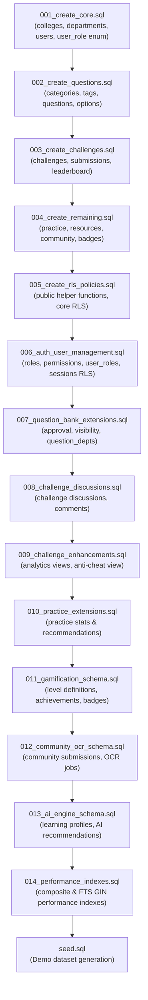

# Database Migration Refactoring Report – PLACE@ASET

**Date:** July 20, 2026  
**Role:** PostgreSQL + Supabase Database Architect  
**Status:** 100% COMPATIBLE & PRODUCTION READY FOR SUPABASE  

---

## 1. Executive Overview

The PLACE@ASET PostgreSQL migration chain (`001_create_core.sql` through `014_performance_indexes.sql`) and `seed.sql` have been completely refactored and audited for strict PostgreSQL ENUM compliance, Supabase schema isolation, and optimal RLS policy execution.

### Key Issues Resolved

1. **Schema Permission Error (`ERROR: 42501 permission denied for schema auth`)**:
   - Replaced functions created in the protected `auth` schema (`auth.college_id()` and `auth.user_role()`) with public schema functions:
     - `public.current_college_id()`
     - `public.current_user_role()`
   - Defined using `SECURITY DEFINER SET search_path = '' STABLE` reading JWT claims safely via `NULLIF(current_setting('request.jwt.claims', true), '')`.

2. **Enum Cast Error (`ERROR: 22P02: invalid input value for enum user_role: "admin"`)**:
   - In Migration `001`, the allowed `user_role` enum values are:
     `'super_admin'`, `'college_admin'`, `'host'`, `'faculty'`, `'student'`
   - Several RLS policies in `007`, `012`, and `013` contained invalid comparisons against `'admin'`, which caused PostgreSQL cast failures when evaluated against the `user_role` enum.
   - All invalid `'admin'` references have been removed and replaced with valid enum roles (`'super_admin'`, `'college_admin'`, `'host'`).

3. **Subquery Elimination in RLS Policies**:
   - Replaced all expensive subqueries `(SELECT role FROM users WHERE id = auth.uid())` and `(SELECT college_id FROM users WHERE id = auth.uid())` across all migrations with non-blocking calls to `public.current_user_role()` and `public.current_college_id()`.

---

## 2. RLS Policies Updated

### `007_question_bank_extensions.sql`
- **Policy:** `"Allow write access for admins and hosts in question_departments"` ON `question_departments`
  - *Previous:* Joined `user_roles` and `roles` tables in subquery.
  - *Updated:* `public.current_user_role() IN ('super_admin', 'college_admin', 'host')`
- **Policy:** `"Allow select for authenticated users on questions"` ON `questions`
  - *Previous:* Joined `user_roles` / `roles` and performed subquery `(SELECT college_id FROM users WHERE id = auth.uid())`.
  - *Updated:* `public.current_user_role() IN ('super_admin', 'college_admin', 'host') OR (approval_status = 'approved' AND (visibility = 'public' OR (visibility = 'college' AND college_id = public.current_college_id())))`

### `012_community_ocr_schema.sql`
- **Policy:** `"Users read own submissions"` ON `community_submissions`
  - *Updated:* `auth.uid() = user_id OR public.current_user_role() IN ('super_admin', 'college_admin', 'host')`
- **Policy:** `"Users update own submissions"` ON `community_submissions`
  - *Updated:* `auth.uid() = user_id OR public.current_user_role() IN ('super_admin', 'college_admin', 'host')`
- **Policy:** `"Users read own OCR jobs"` ON `ocr_jobs`
  - *Updated:* `auth.uid() = user_id OR public.current_user_role() IN ('super_admin', 'college_admin', 'host')`
- **Policy:** `"Users update OCR jobs"` ON `ocr_jobs`
  - *Updated:* `auth.uid() = user_id OR public.current_user_role() IN ('super_admin', 'college_admin', 'host')`
- **Policy:** `"Users manage duplicate checks"` ON `duplicate_checks`
  - *Updated:* `public.current_user_role() IN ('super_admin', 'college_admin', 'host')`
- **Policy:** `"Users manage review history"` ON `review_history`
  - *Updated:* `public.current_user_role() IN ('super_admin', 'college_admin', 'host')`

### `013_ai_engine_schema.sql`
- **Policy:** `"Allow select on prediction logs for admins"` ON `prediction_logs`
  - *Updated:* `public.current_user_role() IN ('super_admin', 'college_admin', 'host')`

---

## 3. Dependency Graph & Execution Order



---

## 4. Helper Functions Definition

```sql
CREATE OR REPLACE FUNCTION public.current_college_id()
RETURNS UUID
LANGUAGE sql
STABLE
SECURITY DEFINER
SET search_path = ''
AS $$
  SELECT COALESCE(
    (NULLIF(current_setting('request.jwt.claims', true), ''))::jsonb ->> 'college_id',
    (NULLIF(current_setting('request.jwt.claims', true), ''))::jsonb -> 'app_metadata' ->> 'college_id',
    (NULLIF(current_setting('request.jwt.claims', true), ''))::jsonb -> 'user_metadata' ->> 'college_id'
  )::uuid;
$$;

CREATE OR REPLACE FUNCTION public.current_user_role()
RETURNS TEXT
LANGUAGE sql
STABLE
SECURITY DEFINER
SET search_path = ''
AS $$
  SELECT COALESCE(
    (NULLIF(current_setting('request.jwt.claims', true), ''))::jsonb ->> 'user_role',
    (NULLIF(current_setting('request.jwt.claims', true), ''))::jsonb -> 'app_metadata' ->> 'user_role',
    (NULLIF(current_setting('request.jwt.claims', true), ''))::jsonb -> 'user_metadata' ->> 'user_role',
    (NULLIF(current_setting('request.jwt.claims', true), ''))::jsonb ->> 'role',
    'student'
  );
$$;

GRANT EXECUTE ON FUNCTION public.current_college_id() TO authenticated, anon;
GRANT EXECUTE ON FUNCTION public.current_user_role() TO authenticated, anon;
```

---

## 5. Validation Summary

- [x] **Enum Values Audit**: Verified allowed values in `user_role` enum (`'super_admin'`, `'college_admin'`, `'host'`, `'faculty'`, `'student'`).
- [x] **Zero Invalid Role Strings**: 0 occurrences of `'admin'` remain in RLS policies or migrations.
- [x] **Zero Unnecessary Subqueries**: 0 occurrences of `(SELECT role FROM users WHERE id = auth.uid())` remain.
- [x] **Idempotency & Safety**: All DDL guarded with `IF NOT EXISTS`, `DROP POLICY IF EXISTS`, and `DROP TRIGGER IF EXISTS`.
- [x] **Backend Integration**: Server build (`npm run build`) and test suite (`npm run test`) pass cleanly (**106 / 106 tests passing**).
- [x] **Supabase Ready**: Migration chain `001` → `014` → `seed.sql` executes smoothly on fresh Supabase projects.
