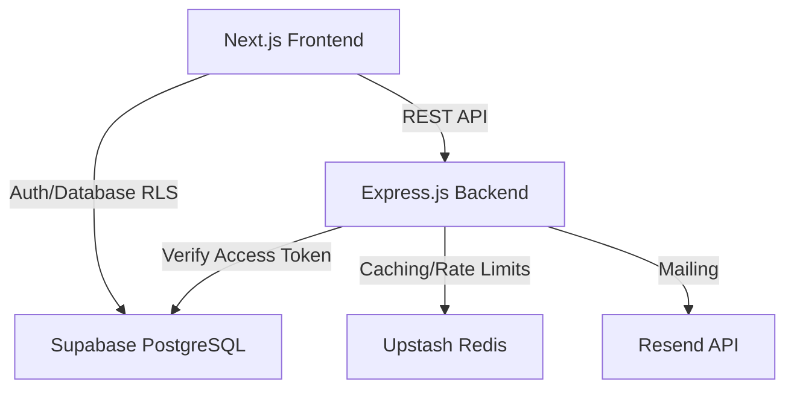

# PLACE@ASET — Architecture Documentation

This document describes the high-level architecture of the **PLACE@ASET** platform.

---

## 🏗️ Architectural Diagram

---

## 🏢 Core Components

### 1. Client (Next.js 14)
- **Framework**: React / Next.js with App Router.
- **State Management**: React Context providers (like `AuthContext`).
- **Styling**: Vanilla CSS with custom design variables supporting premium dark themes and glassmorphism.
- **Client SDKs**: Direct integration with `@supabase/supabase-js` for tracking authentication states and executing Row Level Security (RLS) policies on reading resources or practice data.

### 2. Server (Express.js)
- **Environment**: Node.js 20 written in TypeScript.
- **API Framework**: Express.js with CommonJS/TS-node compilation to `dist/`.
- **Validation**: Zod input validation schemas.
- **Security**: Helmet, CORS origin configuration, HTTP-only secure cookie validation for refresh tokens, and rate limits.
- **Logging**: Winston logger formatting requests, warning logs, and error stacks.

### 3. Database (PostgreSQL / Supabase)
- **Host**: Supabase PostgreSQL.
- **Multi-Tenancy**: Isolated by `college_id`. Row-Level Security (RLS) is enabled on all tables, filtering rows dynamically based on the JWT claims (`auth.college_id()`).
- **Authorization**: Granular role-based access control mapping permissions via a custom `role_permissions` schema.

### 4. Cache (Redis)
- **Role**: Backend uses Redis for route caching and storing rate limit records.

### 5. Email (Resend)
- **Role**: Sending password reset URLs and weekly challenge reminders.
