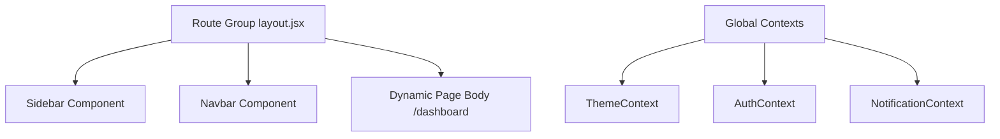

# Student Dashboard & Application Shell Documentation

This document describes the design, routing structures, contexts, widgets, and API handlers implemented for the **Student Dashboard & Application Shell (Module 3)**.

---

## 🏗️ Interface & Shell Architecture

The platform shell is designed around a responsive, modern layout that acts as the primary workspace for candidate learners.

### 1. Root Layout Routing
Using Next.js 14 App Router groups, we isolated the authenticated workspace under the `(dashboard)` route subfolder:
- `/client/src/app/(dashboard)/layout.jsx`: A layout wrapper component checking candidate login session state (via `<ProtectedRoute>`) and laying out the sidebar and top navigation bars.
- `/client/src/app/(dashboard)/dashboard/page.jsx`: The primary landing grid representing the student dashboard.

### 2. Navigation Sidebar (`Sidebar.jsx`)
- Responsive lateral panel with a fixed width of `260px` which transitions off-screen on mobile.
- Features high-contrast glowing active states for routes (`Dashboard`, `Practice Arena`, `Challenges`, `Resource Library`, `Community`, `Achievements`).
- Embeds candidate identity profile summary cards and Sign Out triggers at the bottom.

### 3. Top Header Navigation (`Navbar.jsx`)
- Displays breadcrumbs mapping the pathname route nodes dynamically.
- Embeds global practice search input.
- Hosts the Dark/Light mode theme switch.
- Implements the notification bell counter displaying a dropdown list of recent alerts.
- Embeds avatar menus for quick access to Account settings and profile setup.

---

## 🌓 Global State Contexts

### 1. Theme Context (`ThemeContext.jsx`)
Provides dynamic state variables (`theme`, `toggleTheme`).
- Saves selection to browser `localStorage` under the `theme` key.
- Updates the HTML root element: `document.documentElement.setAttribute('data-theme', theme)`.
- Tailored tokens are implemented in `variables.css` under the `[data-theme="light"]` selector, preserving dark theme as default.

### 2. Notification Context (`NotificationContext.jsx`)
Handles alerts lifecycle.
- Polling: Fetches active notifications every 60 seconds.
- State: Stores notifications list and updates `unreadCount` counters.
- Actions: Offers methods to `markAsRead(id)` and `markAllAsRead()`.

---

## 🧩 Dashboard Widgets

Modular components are implemented in `client/src/components/widgets/`:
1. `ChallengeWidget`: Displays active weekly challenges, time frames, registration triggers, and start indicators.
2. `ProgressWidget`: Progress meters detailing XP progress bar, levels, ranking, current streaks, and longest streaks.
3. `LeaderboardWidget`: Displays a list of top 5 students in the college.
4. `RecentQuestionsWidget`: List of recently viewed or solved DSA and aptitude questions.
5. `ResourcesWidget`: Latest documents and placement resources.
6. `ContributionsWidget`: Displays candidate contribution statistics (count of questions added and XP earned).
7. `UpcomingEventsWidget`: Timed clocks showing upcoming test sessions and prep mock reviews.

---

## 🔌 API Endpoints Reference

| Endpoint | Method | Description | Auth Required |
|---|---|---|---|
| `/api/v1/dashboard/summary` | `GET` | Compiles dashboard statistics, active challenges, leaderboards, resources, and event parameters | Yes |
| `/api/v1/dashboard/stats` | `GET` | Retrieves practice answers correctness rates, XP logs, and detail telemetry | Yes |
| `/api/v1/dashboard/activity` | `GET` | Retrieves recent activity logs | Yes |
| `/api/v1/dashboard/notifications` | `GET` | Fetches active notifications list | Yes |
| `/api/v1/dashboard/notifications/:id/read` | `PUT` | Marks a specific notification as read | Yes |
| `/api/v1/dashboard/notifications/read-all` | `PUT` | Marks all unread notifications as read | Yes |
